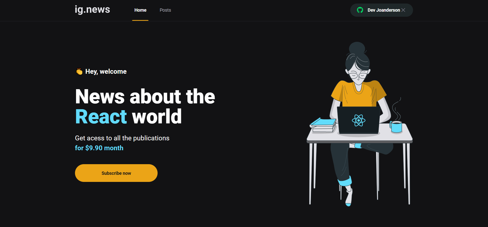

 <h1 align="center">
  ig.news
</h1>

> <b>ig.news</b> é o terceiro projeto criado no chapter 3 da trilha de React do
> Ignite da [Rocketseat](https://github.com/Rocketseat). O projeto consiste num
> blog onde para ler algum psoto você deverá ser assinante, e é usado a API do
> [Stripe](https://stripe.com/) para o controle de pagamento e salvando os dados
> dos inscritos no FaunaDB.

  <a href="#gear-technologies">Technologies</a>&nbsp;&nbsp;&nbsp;|&nbsp;&nbsp;&nbsp;
  <a href="#computer-how-to-run">How to run</a>

 

 />
## :gear: Technologies

Este projeto foi feito utilizando as seguintes tecnologias:

- [React](https://reactjs.org/)
- [Typescript](https://www.typescriptlang.org/)
- [NextJS](https://nextjs.org/)
- [FaunaDB](https://fauna.com/)'
- [Axios](https://github.com/axios/axios)
- [Prismic](https://prismic.io/)
- [Stripe](https://stripe.com/)
- [Sass](https://sass-lang.com/)
- [ESLint](https://eslint.org/)
- [Prettier](https://prettier.io/)

